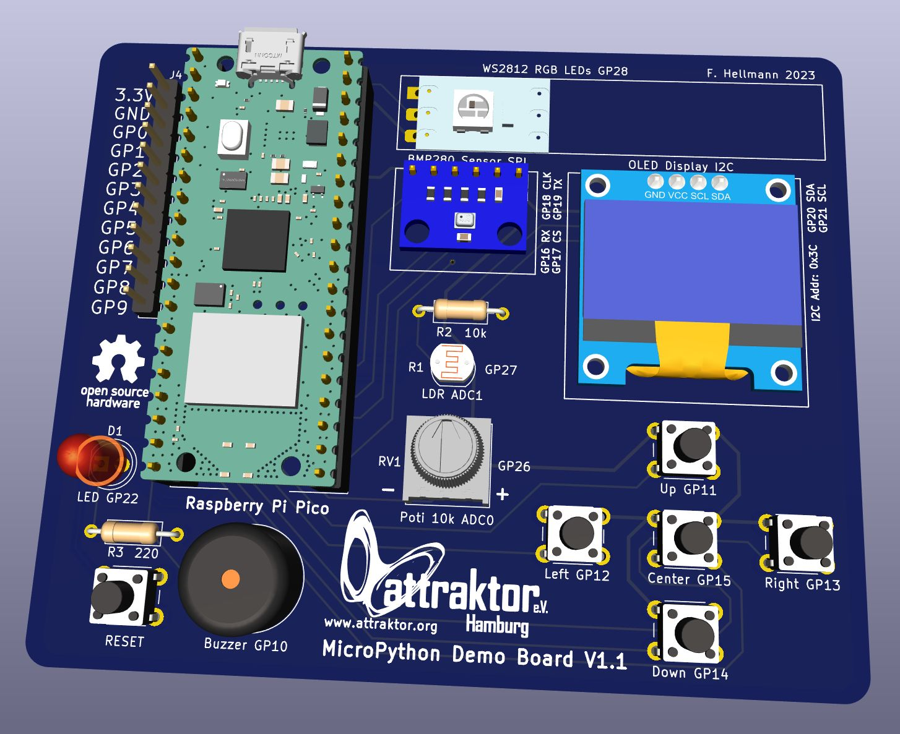
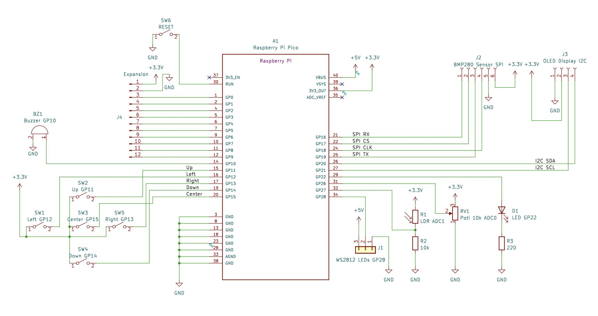
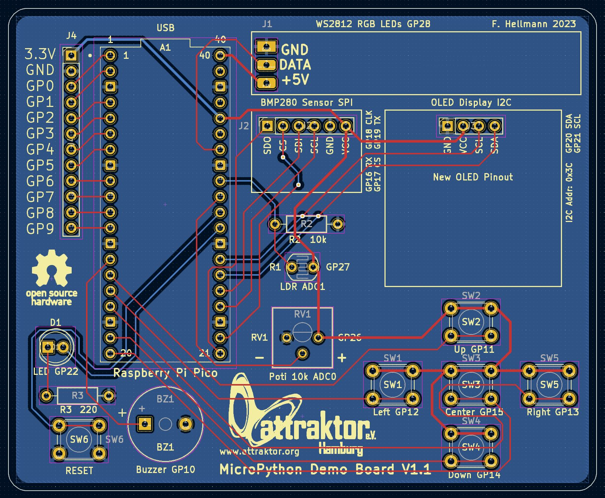

# MicroPython DemoBoard
This repo contains all necessary files for our MicroPython Hardware Workshop at the Attraktor e.V. Makerspace in Hamburg, Germany

You can find the workshop documentation in German here: <a href="https://wiki.attraktor.org/Micropython_Kurs_2023"> Attraktor MicroPython Workshop </a>

### Hardware:
The demoboard works with a Raspberry Pi Pico WH plugged into the pinheaders and connects it to various sensors, buttons, LEDs and an OLED display.

There are two hardware revision to date:
Version 1.0 is the initial version which used an older style of OLED Display with VCC and GND on pins 1 and 2. 
As these old style displays are hard to come by Version 1.1 was spun to change to GND and VCC on pins 1 and 2 as this is a more pinout common.
I would recommend to use Version 1.1 for all new boards.

You can find an interactive BOM (Bill of Material) here: <a href="https://raw.githack.com/sandman72/micropython_demoboard/main/Hardware/KiCAD_DemoBoard_V1.1/MicroPython_DemoBoard_V1.1_iBOM.html" traget="_blank"> iBOM </a>

### Firmware:
Included in the firmware directory is a board test file and the invaders game as self contained UF2 files.
Simply enter the bootsel mode (hold down the bootsel button, while plugging the Pi Pico in) and copy one for the firmwares over.

### Software:
The software folder contains some demo scripts to try out the different sensors, buttons, buzzer, LEDs and display.
Included are some games like space invaders, flappy bird, snake and pong as well.
Also you'll find the test scripts there.
